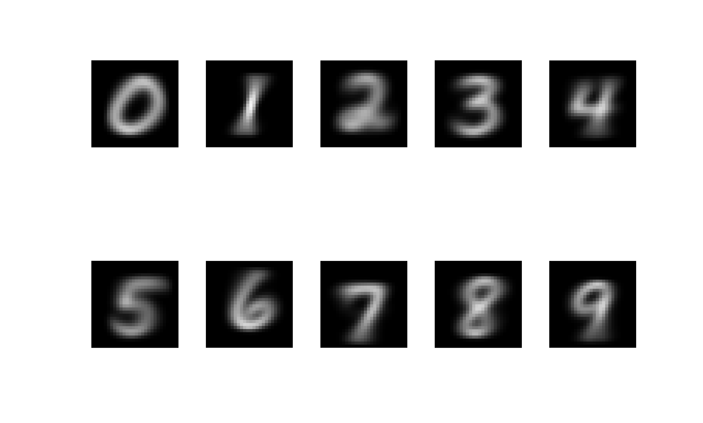
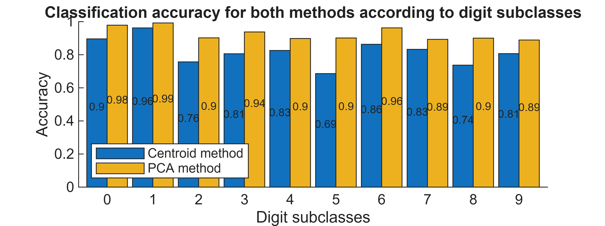
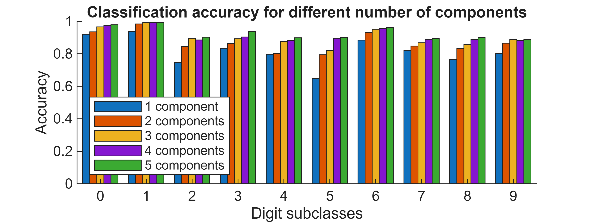

# Handwritten Digit Classification using Centroid and PCA methods

This project explores two classic machine learning approaches for handwritten digit classification using the MNIST dataset:

-  Centroid method (Nearest mean classifier) 
-  Principal Component Analysis (PCA) 

It was developed as part of my exchange semester at Stockholm University (Sweden) to study how dimensionality reduction and distance\-based classification impact accuracy and efficiency.

# Overview

The MNIST dataset contains 70000 grayscale image of handwritten digits (0\-9), each of size 28\*28 pixels.

Our goal is to classify each digit by comparing two methods:

1.  Centroid method: assigns each image to the class whose average (centroid) is closest in Euclidean distance.
2. PCA method: projects each image into a lower\-dimensional subspace defined by the most significant principal components for each digit.
# Dataset

The dataset (`mnistdata.mat`) can be downloaded from [Yann LeCun et al. \- MNIST database (13MB)](<https://web.cs.ucdavis.edu/~bai/MM7024/mnistdata.mat>)

Each variable contains a matrix of images for a specific digit. Each row corresponds to one digit image, reshaped as a vector of 784 pixels values.

# Methods
## 1. Centroid method

The centroid method computes the average image of each digit class and classifies a new image by the nearest average in Euclidean space.

 $$ \hat{y} =\arg \min_k \|z-\mu_k {\|}_2 $$ 

where $z$ is the test image and $\mu_k$ is the mean image of digit $k$.

**Advantages**:

-  Simple and interpretable 
-  Fast to compute 

**Limitations**

-  Sensitive to pixel noise and image variation 
-  Cannot capture complex structure in the data 
## 2. PCA method

The PCA computes a low\-dimensional basis (principal components) for each digit class using singular value decomposition (SVD).

Each test digit is projected into each digit's subspace, and classification is based on reconstruction error:

 $$ \hat{y} =\arg \min_k \|z-U_k U_k^T z{\|}_2 $$ 

where $U_k$ contains the top principal components for digit $k$.

**Advantages**:

-  REduce noise and dimensionality 
-  Captures dominant variation accros samples 

**Limitations**

-  Computationally more expensive 
-  Requires careful selection of the number of components 
# Implementation

The project is implemented in Matlab. A more detailed report can be found in `Report/report.md.`

# Results
||||
| :-- | :-- | :-- |
| **Method**  | **Average accuracy**  | **Observation**   |
| Centroid method  | ~80%  | Perfoms well but struggles with digits 2, 5 and 8   |
| PCA (5 components)  | ~88\-90%  | More accurate and stable (benefits from dimensionality reduction)   |

Despite lower performance for some digits, the PCA method clearly outperforms the centroid classifier.

We further explored the effects of the number of PCA components on accuray. Increasing the number of components improves results up to a point (~5 components), after which returns diminish.

