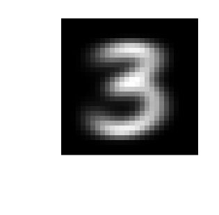

<a id="TMP_5548"></a>

# Centroid and PCA Algorithms for handwritten digit classification

As part of my exchange semester at Stockolm University (Sweden), I completed several educational machine learning projects. In this project, we investigate two ways to classify a digit: the centroid algorithm and the PCA algorithm.

<!-- Begin Toc -->

## Table of Contents
&emsp;[Get started](#TMP_21ff)
 
&emsp;[Part 1 : The Centroid method](#TMP_742a)
 
&emsp;[Part 2 : The PCA method](#TMP_20df)
 
&emsp;[Comparison & conclusions](#TMP_4606)
 
&emsp;[Optional : Optimize PCA performance by choosing the optimal number of components](#TMP_2c4a)
 
<!-- End Toc -->
<a id="TMP_21ff"></a>

# Get started
<a id="TMP_95d5"></a>

The MNIST database of handwritten digits \-\- Yann LeCun (NYU) Corinna Cortes (Google), Chris J. C. Burges (Microsoft Research) can be downloaded from [mnistdata.mat (13MB)](<https://web.cs.ucdavis.edu/~bai/MM7024/mnistdata.mat>).

```matlab
clear;
load mnistdata;

% Visualize a selected train/test digit 
figure(1)
n = 6; 
for i = 1:n*n 
   digit      = train8(i,:); 
   digitImage = reshape(digit,28,28); 
   subplot(n,n,i); 
   image(rot90(flipud(digitImage),-1)); 
   colormap(gray(256)); 
   axis square tight off; 
end
```


```matlab

% Visualize the average train digits 
T(1,:)  = mean(train0); 
T(2,:)  = mean(train1); 
T(3,:)  = mean(train2); 
T(4,:)  = mean(train3); 
T(5,:)  = mean(train4); 
T(6,:)  = mean(train5); 
T(7,:)  = mean(train6); 
T(8,:)  = mean(train7); 
T(9,:)  = mean(train8); 
T(10,:) = mean(train9); 

for i = 1:10
    digitImage_mean(:,:,i) = reshape(T(i,:),28,28); 
end

figure(2)
for i = 1:10 
    subplot(2,5,i) 
    image(rot90(flipud(digitImage_mean(:,:,i)),-1)); 
    colormap(gray(256)); 
    axis square tight off; 
end
```


The first figure above gives a sample of different instances of digit 8 in the data matrix 'train8'. The second figure shows the average of all the 0 digits, the average of all the 1 digits, and so on. The data is separated into two categories: train and test. Each category contains 10 sets of digits from 0\-9. Each row vector of length 784 is a 28\-by\-28 image.

```matlab
 whos('-file','mnistdata.mat')
```

```matlabTextOutput
  Name           Size               Bytes  Class    Attributes

  test0        980x784             768320  uint8              
  test1       1135x784             889840  uint8              
  test2       1032x784             809088  uint8              
  test3       1010x784             791840  uint8              
  test4        982x784             769888  uint8              
  test5        892x784             699328  uint8              
  test6        958x784             751072  uint8              
  test7       1028x784             805952  uint8              
  test8        974x784             763616  uint8              
  test9       1009x784             791056  uint8              
  train0      5923x784            4643632  uint8              
  train1      6742x784            5285728  uint8              
  train2      5958x784            4671072  uint8              
  train3      6131x784            4806704  uint8              
  train4      5842x784            4580128  uint8              
  train5      5421x784            4250064  uint8              
  train6      5918x784            4639712  uint8              
  train7      6265x784            4911760  uint8              
  train8      5851x784            4587184  uint8              
  train9      5949x784            4664016  uint8              
```

<a id="TMP_742a"></a>

# Part 1 : The Centroid method

The centroid method consists of :

1.  Compute the distance between each class mean and the test image
2. Classify the test digits by minimizing the distance

As an example, the following code takes a digit from the testing set and computes the 2\-norm distances between this digit and the 10 average train digits computed above.

```matlab
z    = double(test7(55,:)); 
dist = zeros(10,1);

for k = 1:10 
    dist(k) = norm( z - T(k,:) ); 
end 
dist 
```

```matlabTextOutput
dist = 10x1
1.0e+03 *

    2.4099
    2.0790
    2.0986
1.9529
2. 9810
3. 9689
    2.1937
1.5645
2. 9331
3. 6696

```


Since the 2\-norm distance between unknown digit and the average training digit 7 is the smallest, our simple classification algorithm will label unknown digit as '7' which is indeed the correct answer. Note also that average train digit 7 is actually T(8,:) because MATLAB indexing starts at 1.


Now we define the function *guess\_labels\_from\_centroid\_method* that generalizes the label guessing by minimizing the 2\-norm distance between test digits and average train digits. This function's output is an n\-by\-1 vector containing the labels (0\-9) for each digits in *digits* according to the pre\-computed training average digits contained in *average\_digits*.

```matlab
function labels = guess_labels_from_centroid_method(digits, average_digits)
    digits = double(digits);
    n      = length(digits); % Number of samples
    labels = zeros(n,1); % Output

    % For each digit
    for  i = 1:n
        dist = zeros(10,1);

        % Compute the 2-norm distance between this digit and the 10 average
        for k = 1:10
            dist(k) = norm(digits(i,:)-average_digits(k,:));
        end

        % Keep the index of the minimum distance 
        [~,I]     = min(dist);
        labels(i) = I-1; % Minus 1 because indexes start at 1 in Matlab
    end
    
end 
```
<a id="TMP_20df"></a>

# Part 2 : The PCA method

The PCA method attempts to identify characteristic properties of each digit, based on the training data, and compares these properties with those of the test digit in order to make an identification. Here, the characteristic properties are the principal components extracted from the training set.


The PCA method consists of :

1.  Finding optimal number of principal components by comparing cumulative explained variance
2. Finding the principal components of each digit training set
3. Calculating the least square solution : minimizing the distance between original test digit and its PCA projection
4. Classifying the test set of digit by minimizing the previous distance

These five singular vectors represent the five dominant characteristics of the digit '3'. They also form an approximate basis for the space of all possible digit 3's.


To visualize the PCA components we use the *viewdigit* function that reshape and rescale data to obtain an image from the input vector.

```matlab
function viewdigit(digit)
% input: a vector of length 784 
  
   % reshape to 28 by 28 image
   a1 = reshape(double(digit),28,28);
   
   % rescale 
   a1         = (a1-min(min(a1))*ones(size(a1)));
   a1         = (256/max(max(a1)))*a1;
   digitImage = 256*ones(size(a1)) - a1; 
   
   % figure
   figure('Position',[-10 -10 50 50]);
   image(rot90(flipud(digitImage),-1)); 
   colormap(gray(256)); 
   axis square tight off; 
end
```

```matlab
[U3,~,~] = svds(double(train3'), 5) ;
size(U3)
```

```matlabTextOutput
ans = 1x2
   784     5

```

```matlab
viewdigit(U3(:,1)); 
```



```matlab
viewdigit(U3(:,2)); 
```


We can test how well a digit $z$ can be represented in this basis $U_3$ of digit 3 by solving the least square problem: 

 $$ \min_x \|z-U_3 x{\|}_2 $$ 

which has the solution: 

 $$ \min_x \|z-U_3 x{\|}_2 =\|z-U_3 U_3^T z{\|}_2 $$ 

Now that we have a way to measure how far away an unknown digit is from 'looking' like digit 3, let's do the same for all digits 0 to 9. We generate approximate bases for all ten digits in this way :

```matlab
basis_len = 5; 
Us        = zeros( 28*28, basis_len, 10);

for k = 1:10 
    % go through each digit 0 to 9 
    s = strcat('train',num2str(k-1)); 
    A = double(eval(s)); 
    % and get first 5 singular vector 
    [U,~,~]   = svds( A', basis_len ); 
    Us(:,:,k) = U; 
end 
```

The essence of this PCA approach is that for a given unknown digit $z$ (say, *test4(15,:)*) we compute this number

 $$ \|z-U_k U_k^T z{\|}_2 $$ 

for all digit $k$ from 0 to 9 and choose $z$ 's label based on how well $z$ are represented by approximate bases $U_0 ,U_1 ,...,U_9$. For example, we assign the label 3 if

 $$ \|z-U_3 U_3^T z{\|}_2 $$ 

gives the smallest number. Let's try that on a test digit :

```matlab
z    = double(test4(14,:))'; 
dist = zeros(10,1);

for k = 1:10 
    Uk      = Us(:,:,k); 
    dist(k) = norm( z - Uk*(Uk'*z) ); 
end 

dist 
```

```matlabTextOutput
dist = 10x1
1.0e+03 *

    2.1859
    2.1720
    2.1305
    2.1573
1.4873
    2.1208
    2.0254
1.9824
2. 9618
3. 7316

```


Since *test4(14,:)* is best represented by the approximate basis of digit 4 (this is indicated by the smallest number). It gets labeled with '4' which is the correct answer !


Now we generalize this process by using the function *guess\_labels\_from\_PCA\_method.*

```matlab
function labels = guess_labels_from_PCA_method(digits, digits_components)
    digits = double(digits)';
    n      = length(digits);% Number of samples
    labels = zeros(n,1);% Output

    % For each digit
    for  i = 1:n
        % Compute dist between digits components and current digit
        dist = zeros(10,1);

        for k=1:10
            Uk      = digits_components(:,:,k);% Get the digits components for the current digit
            dist(k) = norm( digits(:, i) - Uk*(Uk'*digits(:, i)) );% Compute the 2-norm distance
        end

        % Keep the index of the minimum distance 
        [~,I]     = min(dist);
        labels(i) = I-1; % Minus 1 because indexes start at 1 in Matlab
    end
end 
```

As an example, below is the labels guessed for subgroup of 0 in test set.

```matlab
% guess_labels_from_PCA_method(test0, Us)
```
<a id="TMP_4606"></a>

# Comparison & conclusions
<a id="TMP_4fcc"></a>

In order to compare the two methods, we use the accuracy on the test set. The *report\_success\_rate* function computes accuracy on each test digit subclass with the method specified as input

```matlab
function results = report_success_rate(computational_method, method_param)
    accuracy    = zeros(10,1);% Results matrix
    results     = [];
    
    % For each test set :
    for test_set_index             = 0:9
        test_set                   = evalin('base', "test"+test_set_index);% Get the test set
        labels                     = computational_method(test_set, method_param);% Compute labels
        accuracy(test_set_index+1) = sum(labels==test_set_index)/length(labels);% Compute accuracy
        results                    = [results ; accuracy(test_set_index+1)];
    end
end
```

```matlab
% Accuracy results for the centroid method and the PCA method
acc_centroid = report_success_rate(@guess_labels_from_centroid_method, T);
acc_PCA      = report_success_rate(@guess_labels_from_PCA_method, Us);
accuracies   =  [acc_centroid zeros(10,1) acc_PCA];

figure('Position', [50 50 800 300])
b = bar((0:9),accuracies, 2);
legend({'Centroid method', '', 'PCA method'},'Location','southwest');
xlabel("Digit subclasses");
ylabel("Accuracy");

% Add text labels on each bar
x = b(1).XEndPoints; % x positions for group 1 bars
y = b(1).YEndPoints; % y positions for group 1 bars
text(x, y/2, string(round(acc_centroid,2)), 'HorizontalAlignment','center', 'VerticalAlignment','bottom', 'FontSize', 7);

x = b(3).XEndPoints; % group 2 bars
y = b(3).YEndPoints;
text(x, y/2, string(round(acc_PCA,2)), 'HorizontalAlignment','center', 'VerticalAlignment','bottom', 'FontSize', 7);

title("Classification accuracy for both methods according to digit subclasses")
box off
```


Despite relatively low accuracy for digits 5, 8 and 2, the centroid method seem to be efficient on this dataset as accuracy rate is globally above 80%.


On the other hand, the PCA method seems to be more efficient than the previous one. With rates no lower than 88%, we can say that PCA is suitable for the analysis of this handwritten digit dataset. We can howerever, try to improve these rates by changing the length of the basis.

<a id="TMP_2c4a"></a>

# Optional : Optimize PCA performance by choosing the optimal number of components

Choosing the optimal number of PCA components consists of :

1.  Computing singular values associated with 20 first components for each digit subclass
2. Plotting the singular values and looking for a marked elbow
```matlab
basis_len       = 20;
Us              = zeros(28*28, basis_len, 10);
singular_values = zeros(basis_len, 10);% Singular for each digits
components      = zeros(basis_len, 10);% PCA components for each digits

% Compute eigenvalues
for k = 1:10
    s                    = strcat('train', num2str(k-1));
    A                    = double(eval(s));
    [U,S,~]              = svds( A', basis_len);
    singular_values(:,k) = diag(S); % Record the values of eigenvalues
    Us(:,:,k)            = U;
end

figure('Position', [50 50 800 300])
hold on
% Plot results on the same graph for every digit
for i = 1:size(singular_values, 2)
    plot(singular_values(:,i), 'DisplayName', string("Digit " + num2str(i-1)))
end

title("Singular values associated with PCA components")
xlabel("PCA components");
ylabel("Singular values");
legend('Location','northeast');

box off
```


Since the elbows are not very pronounced, we choose to look at several model performance for *basis\_len* from 2 to 5 :

```matlab
accuracies      = [];
max_n_component = 5;

for n_component = 1:max_n_component
    accuracies = [accuracies report_success_rate(@guess_labels_from_PCA_method, Us(:,1:n_component,:))];
end

figure('Position', [50 50 800 300])
b = bar((0:9),accuracies, 1);

legend_names = {};
for n_component = 1:max_n_component
    % Add text labels on each bar
    x = b(n_component).XEndPoints; % x positions for group 1 bars
    y = b(n_component).YEndPoints; % y positions for group 1 bars
    legend_names{1,n_component} = string(n_component + " components");
    text(x, y/2, string(round(acc_centroid,2)), 'HorizontalAlignment','center', 'VerticalAlignment','bottom', 'FontSize', 7);
end

legend_names{1,1} = "1 component";
legend(legend_names,'Location','southwest');
xlabel("Digit subclasses");
ylabel("Accuracy");
title("Classification accuracy for different number of components");

box off
```


In conclusion, *basis\_len = 5* is actually a pretty good guess as it allows to improve model accuracy without considering too many components in PCA decomposition.

